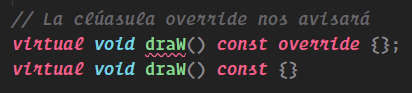

# Programacion Orientada a Objetos

<details id=1 open>
<summary><h2>¿Que es un Objeto?</h2></summary>

 - Un Objeto es la representación de cosas del mundo fisico con una estructura 
interna la cual abstraemos con propeidades y métodos los cuales le dan una utilidad
y funcinalidad al mismo.

</details>

<details id=2 open>
<summary><h2>¿Que es un Atributo o Propiedad?</h2></summary>

<ul>
<br>    <li>Los atributos son las características o propiedades que definen a un objeto.</li>
<br>    <li>Puedes pensar en ellos como las “variables” de la clase. Por ejemplo, en una clase que representa un teléfono, los atributos podrían ser la marca, el modelo, el color y el tamaño.</li>
<br>    <li>Cada objeto creado a partir de esa clase (cada teléfono que “fabricamos” con nuestro molde) puede tener diferentes valores para estos atributos.</li>
</ul>

</details>


<details id=3 open>
<summary><h2>¿Que es un Metodo?</h2></summary>

<ul>
<br>    <li>Los métodos son como las funciones de la clase. Representan las acciones que los objetos pueden realizar.</li>
<br>    <li>Siguiendo con nuestro ejemplo del teléfono, algunos métodos podrían ser <em><strong>hacerLlamada(), enviarMensaje() o tomarFoto()</strong></em>.</li>
<br>    <li>En resumen, los atributos son las características que distinguen a un objeto de otro, mientras que los métodos son las acciones que puede realizar un objeto. Juntos, dan vida a nuestros objetos, haciéndolos únicos y funcionales.</li>
</ul>

</details>

<details id=4 open>
<summary><h2>Ejemplo de Objeto</h2></summary>

```c++
class atleta {

    // atributos
    int energia;
    int velocidad;
    char nombre[15];
    float telefono;

    // metodos
    void aumentoVelocidad(){
      velocidad++;
      energia--;
    };
};
```

</details>

<details id=5 open>
<summary><h2>Constructor</h2></summary>

- Un constructor es una función especial que se utiliza para crear un nuevo objeto o 
instancia de una clase.
  - Inicializan el objeto y asignan valores iniciales a sus atributos.
  - Se invocan automáticamente cuando se crea un nuevo objeto a partir de una clase.
  - Son métodos que se ejecutan al crear un objeto de una clase específica.

</details>

<details id=6 open>
<summary><h2>Creación de un Constructor</h2></summary>

- Siempre se declara con el mismo nombre de la clase.
- Todo lo que esta declarado dentro de un objeto es privado, por lo tanto no se puede acceder
desde fuera al objeto.
```c++
#include <iostream>
#include <string.h>
#include <stdio.h>
#include <stdlib.h>
using namespace std;

class atleta {

    // atributos
    int energia;
    int velocidad;
    char nombre[15];
    float telefono;

    // constructor por defecto
public:
    atleta(){
        energia   = 100;
        velocidad = 0;
        strcpy_s(nombre, "Julian");
    };

    // constructor personalizado
    atleta(int e, int v, char n[15]){
        energia = e;
        velocidad = v;
        strcpy_s(nombre, n);
    };

    // metodos
    void aumentoVelocidad(){
      velocidad++;
      energia--;
    };
    
};
```

</details>

<details id=7 open>
<summary><h2>Encapsulamiento</h2></summary>

- El encapsulamiento en programación es el proceso de ocultar o proteger los datos 
  y las operaciones de un objeto de manera que sólo se puedan acceder o modificar 
  mediante los métodos definidos para ese objeto.

</details>

<details id=8 open>
<summary><h2>Ejemplo Encapsulamiento</h2></summary>

```c++
#include <iostream>
#include <string.h>
#include <stdio.h>
#include <stdlib.h>
using namespace std;

class atleta {

private:
    // atributos
    int energia;
    int velocidad;
    char nombre[15];
    float telefono;

    // constructor por defecto
public:
    atleta(){
        energia   = 100;
        velocidad = 0;
        strcpy_s(nombre, "Julian");
    };

    // constructor personalizado
    atleta(int e, int v, char n[15]){
        energia = e;
        velocidad = v;
        strcpy_s(nombre, n);
    };

    // metodos
    void aumentoVelocidad(){
      velocidad++;
      energia--;
    };

    // metodo para devolver un atributo encapsulamiento
    int getVelocidad() { return velocidad };
};
``` 

</details>

<details id=9 open>
<summary><h2>Metodos Get y Set</h2></summary>

- En programación, los métodos get y set se utilizan para obtener y almacenar valores de
  variables.
  -  El método get se utiliza para ***obtener o recuperar el valor de una variable concreta de una clase***.
  -  El método set se utiliza para ***almacenar las variables***.

Los métodos get y set son simples métodos que usamos en las clases para mostrar (get) o 
modificar (set) el valor de un atributo.

```c++
#include <iostream>
#include <string.h>
#include <stdio.h>
#include <stdlib.h>
using namespace std;

class atleta {

private:
    // atributos
    int energia;
    int velocidad;
    char nombre[15];
    float telefono;

    // constructor por defecto
public:
    atleta(){
        energia   = 100;
        velocidad = 0;
        strcpy_s(nombre, "Julian");
    };

    // constructor personalizado
    atleta(int e, int v, char n[15]){
        energia = e;
        velocidad = v;
        strcpy_s(nombre, n);
    };

    // metodos
    void aumentoVelocidad(){
      velocidad++;
      energia--;
    };

    // metodo para devolver un atributo encapsulamiento
    // metodos set and get
    int getVelocidad() { return velocidad };
    int getEnergia() { return energia };
    char* getNombre() { return nombre; }

    void setVelocidad( int valocidad ) {
        velocidad = 36;
    };

    void setEnergia( int energia ){
      energia = 50;
    };

    void setNombre( char n[15] ){ strcpy_s(nombre, n);  }
    
    void todosLosAtributos(){
      cout << "Nombre:    " << name;
      cout << "Energia:   " << energia;
      cout << "Valocidad: " << velocidad;
    };
};
``` 

</details>

<details id=10 open>
<summary><h2>Seguridad en Datos Privados</h2></summary>

- La seguridad de los datos se centra en proteger los datos contra el acceso no autorizado
  y el uso indebido. Para las organizaciones, la práctica de la seguridad de los datos es
  en gran medida la implementación de controles para evitar que los piratas informáticos
  y los usuarios internos manipulen los datos.

</details>

<details id=11 open>
<summary><h2>Destructor</h2></summary>

- Los destructores son una parte importante de la programación orientada a objetos. 
  Nos permiten liberar recursos de manera automática y realizar tareas de limpieza 
  antes de que un objeto sea eliminado o destruido. Al utilizar destructores, podemos 
  evitar fugas de memoria y problemas de gestión de recursos en nuestro código.
    
    - En lenguajes como C++ o C#, los destructores se definen utilizando el símbolo “~” 
      seguido del nombre de la clase. Estos métodos se ejecutan automáticamente cuando un
      objeto está siendo eliminado, ya sea porque su ciclo de vida ha terminado o porque
      se está liberando la memoria asignada a ese objeto.
  
    - Los destructores se emplean especialmente para liberar recursos que han sido asignados
      dinámicamente durante la vida útil de un objeto. Ejemplos de estos recursos incluyen 
      archivos abiertos, conexiones a bases de datos o memoria asignada dinámicamente.
  
    - El destructor se encarga de cerrar archivos, desconectar bases de datos o liberar 
      memoria antes de que el objeto sea destruido o eliminado.

Para la variable el compilador liberaq la memoria al final, meintras que el objeto se 
debe eliminar de manera manual.
```c++
#include <iostream>
#include <string.h>
#include <stdio.h>
#include <stdlib.h>
using namespace std;

class atleta {

private:
    // atributos
    int energia;
    int velocidad;
    char nombre[15];
    float telefono;

    // constructor por defecto
public:
    atleta(){
        energia   = 100;
        velocidad = 0;
        strcpy_s(nombre, "Julian");
    };

    // constructor personalizado
    atleta(int e, int v, char n[15]){
        energia = e;
        velocidad = v;
        strcpy_s(nombre, n);
    };

    // metodos
    void aumentoVelocidad(){
      velocidad++;
      energia--;
    };

    // metodo para devolver un atributo encapsulamiento
    // metodos set and get
    int getVelocidad() { return velocidad };
    int getEnergia() { return energia };
    char* getNombre() { return nombre; }

    void setVelocidad( int valocidad ) {
        velocidad = 36;
    };

    void setEnergia( int energia ){
      energia = 50;
    };

    void setNombre( char n[15] ){ strcpy_s(nombre, n);  }
    
    void todosLosAtributos(){
      cout << "Nombre:    " << name;
      cout << "Energia:   " << energia;
      cout << "Valocidad: " << velocidad;
    };
};

int main() {
    char aux[15];
    // Creamos un nuevo objeto altleta
    strcpy_s(aux, "U, Bolt");
    atleta Bolt(80,20,aux);

    //Creamos otro objeto atleta
    strcpy_s(aux, "M, Phell");
    atleta* Michael = new atleta(30,15, aux);
    Michael -> todosLosAtributos();
    delete Michael;
    return 0;
};
```

</details>

<details id=12 open>
<summary><h2>Herencia</h2></summary>

- Permite que una clase adquiera propiedades y comportamientos de otra clase existente.

</details>

<details id=13 open>
<summary><h2>Protected</h2></summary>

- En programación, la palabra clave "protected" se utiliza para declarar una variable como 
  protegida. Si una clase hereda de otra, tendrá acceso a las variables/funciones protegidas
  de la super-clase, de lo contrario, no podrá acceder a ellas1. Cuando definimos un atributo 
  o método como protected, solo podrán tener acceso las clases y objetos que pertenezcan al 
  mismo paquete, sean objetos de la misma clase o a las subclases y sus respectivos objetos.

</details>

<details id=14 open>
<summary><h2>Polimorfismo</h2></summary>

- El polimorfismo es la capacidad de manejar distintas clases heredadas de una clase base de la
  misma forma. Este ejemplo simplificado muestra un posible resultado a implementar polimorfismo:

```c++
// Tenemos tres punteros con formas heredadas de Shape
Shape *shape1 = new Circle;
Shape *shape2 = new Rectangle;
Shape *shape3 = new Oval;

// Una función que toma una Shape de cualquier tipo derivado
void draw_shape(Shape* shape_ptr)
{
shape_ptr->draw();
}
```

- La función draw_shape utiliza el polimorfismo de clases para llamar al método draw() que tiene
  cualquier Shape, independientemente que su implementación sea distinta en cada caso. Gracias a
  los punteros y la gestión por referencia esto es posible.

</details>

<details id=14 open>
<summary><h2>Virtual y Overrider</h2></summary>

## Virtual
- Una función virtual es una función miembro que se declara dentro de una clase base y es redefinida
  (anulada) por una clase derivada. Cuando se hace referencia a un objeto de clase derivada mediante
  un puntero o una referencia a la clase base, se puede llamar a una función virtual para ese objeto
  y ejecutar la versión de la función de la clase derivada:
  
  - Las funciones virtuales garantizan que se llame a la función correcta para un objeto, 
    independientemente del tipo de referencia (o puntero) utilizado para la llamada a la función.
  - Se utilizan principalmente para lograr el polimorfismo en tiempo de ejecución. 
  - Las funciones se declaran con una palabra clave virtual en la clase base. 
  - La resolución de la llamada a la función se realiza en tiempo de ejecución.
  
***Reglas para funciones virtuales***

1. Las funciones virtuales no pueden ser estáticas. Una función virtual puede ser una función amiga
   de otra clase. 
2. Se debe acceder a las funciones virtuales utilizando el puntero o la referencia del tipo de clase
   base para lograr el polimorfismo en tiempo de ejecución. 
3. El prototipo de funciones virtuales debe ser el mismo en la base, así como en la clase derivada. 
4. Siempre se definen en la clase base y se anulan en una clase derivada. No es obligatorio que la
   clase derivada anule (o redefina la función virtual), en ese caso se utiliza la versión de la base.
   Una clase puede tener un destructor virtual, pero no puede tener un constructor virtual. Para 
   construir un objeto, un constructor necesita el tipo exacto del objeto que a crea y no se puede
   tener un puntero a un constructor (el objeto aún no existe).


```c++
#include <iostream>

class Shape
{
public:
    Shape() = default;
    Shape(std::string description) 
        : description(description){};

    // Función virtual a implementar en clase derivada
    virtual void draw() const
    {
        std::cout << "Dibujando " << description << "\n";
    }

protected:
    std::string description{""};
};

class Circle : public Shape
{
public:
    Circle() = default;
    Circle(std::string description, double radius)
        : Shape(description), radius(radius){};

    // Implementación de la función virtual
    virtual void draw() const
    {
        std::cout << "Dibujando " << description
                  << " con radio " << radius << "\n";
    }

protected:
    double radius{};
};

main()
{
    Shape shape("Forma");
    Circle circulo("Circulo", 4.5);

    shape.draw();   // Dibujando Forma
    circulo.draw(); // Dibujando Circulo con radio 4.5

    return 0;
}
```
Ahora que tenemos un método virtual en la clase derivada podemos crear una función que simplemente
reciba un puntero o referencia de una instancia de Shape o sus clases derivadas y ejecutar su 
método draw() sin preocuparnos por su tipo:

```c++
// Funciones que llaman a una base o sus derivadas
void draw_shape_puntero(Shape *s)
{
s->draw();
}

void draw_shape_referencia(Shape &s)
{
s.draw();
}

main()
{
Shape shape("Forma");
Circle circulo("Circulo", 4.5);

draw_shape_puntero(&shape);
draw_shape_referencia(shape);
draw_shape_puntero(&circulo);
draw_shape_referencia(circulo);

return 0;
}
```
##  Overrider
Puede ser que mientras estamos definiendo los métodos de la clase base en las derivadas tengamos un
despiste y en lugar de referirnos a un método por su nombre lo llamemos distinto, por ejemplo en
lugar de draw pongamos por error draW. Esto generará un método nuevo que no substituirá al original.

Para evitar esta situación, podemos establecer el especificador override como una buena práctica en
todos los métodos de las derivadas que estén implementados sobre un método virtual, de esa manera el
propio editor o compilador nos avisará de que tengamos cuidado, pues ese método no se encuentra en la
clase base:



***Link de material util:***
https://docs.hektorprofe.net/cpp/
</details>